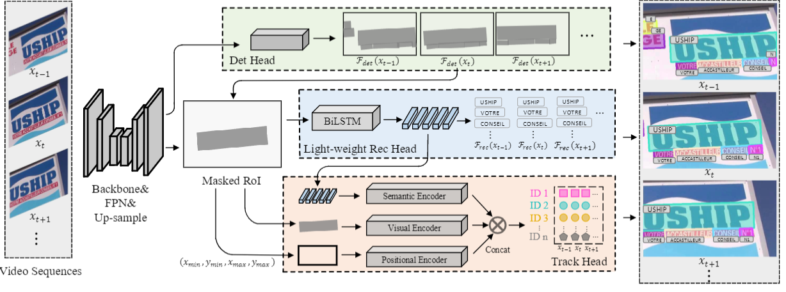

# CoText

## Real-Time End-to-End Video Text Spotting with Contrastive Representation Learning


[](https://opensource.org/licenses/MIT)




## Introduction
[Real-Time End-to-End Video Text Spotting with Contrastive Representation Learning](https://arxiv.org/abs/2207.08417) | [Youtube Demo](https://www.youtube.com/watch?v=zXgEzWhfGBM)
Video text spotting(VTS) is the task that requires simultaneously detecting, tracking and recognizing text instances in the video. Existing video text spotting methods typically develop sophisticated pipelines and multiple models, which is no friend for real-time applications. Here we propose a real-time end-to-end video text spotter with Contrastive Representation learning (CoText). Our contributions are three-fold: 1) For the first time, we simultaneously address the three tasks (e.g., text detection, tracking, recognition) in a real-time end-to-end trainable framework.
2) With contrastive learning, CoText models long-range dependencies and learning temporal information across multiple frames. 3) A simple, light-weight architecture is designed for effective and accurate performance, including GPU-parallel detection post-processing, CTCbased recognition head with Masked RoI, and track head with contrastive learning. Extensive experiments show the superiority of our method. Especially, CoText achieves an video text spotting IDF1 of 72.0% at 35.2 FPS on ICDAR2015video [13], with 10.5% and 26.2 FPS improvement
the previous best method.

Link to our new benchmark [BOVText: A Large-Scale, Bilingual Open World Dataset for Video Text Spotting](https://github.com/weijiawu/BOVText-Benchmark)


## Updates

- (21/07/2022) Releasing the model code(more standard version will be released later).

- (04/07/2022) CoText is accepted by ECCV2022.

- (03/31/2022) Refactoring the code.  


## Performance

### [ICDAR2015(video) Tracking challenge](https://rrc.cvc.uab.es/?ch=3&com=evaluation&task=1)

Methods | MOTA | MOTP | IDF1 | Mostly Matched |	Mostly Lost | FPS
:---:|:---:|:---:|:---:|:---:|:---:|:---:
CoText(640) | 47.4	|72.3|65.3	|41.4	|31.5	| 59.5
CoText(832) | 51.4	|73.6|68.6	|49.6	|23.5	|41.0

### [ICDAR2015(video) Video Text Spotting challenge](https://rrc.cvc.uab.es/?ch=3&com=evaluation&task=1)
Methods | MOTA | MOTP | IDF1 | Mostly Matched |	Mostly Lost | FPS
:---:|:---:|:---:|:---:|:---:|:---:|:---:
CoText(640) | 53.6	| 72.4 | 67.6	|40.2	|32.8	|59.5
CoText(736) | 57.8	| 74.2 | 70.3	|45.9	|28.6	|49.6
CoText(832) | 59.0	| 74.5 | 72.0	|48.6	|26.4	|41.0

#### Notes
- The training time is on 8 NVIDIA V100 GPUs with batchsize 16.
- We use the models pre-trained on COCOTextV2.
- We do not release the recognition code due to the company's regulations.


## Demo
  


## Installation
The codebases are built on top of [PAN++](https://github.com/whai362/pan_pp.pytorch).

* Linux, CUDA>=9.2, GCC>=5.4
  
* Python>=3.7

    We recommend you to use Anaconda to create a conda environment:
    ```bash
    conda create -n CoText python=3.7 pip
    ```
    Then, activate the environment:
    ```bash
    conda activate CoText
    ```
  
  
* Other requirements
    ```bash
    pip install -r requirements.txt
    ```

* Build KP
    ```bash
	cd models/kp
	python setup.py clean && python setup.py bdist_wheel
	cd dist && pip install kprocess-0.1.0-cp37-cp37m-linux_x86_64.whl --force-reinstall
    ```
## Usage

### Dataset preparation

1. Please download [ICDAR2015](https://rrc.cvc.uab.es/?ch=3&com=evaluation&task=4) and [COCOTextV2 dataset](https://bgshih.github.io/cocotext/).


2. You should modify the corresponding path in *cov_ICDAR15video_to_ICDAR15.py* and use the following script to generate txt file:


```bash 
cd utils
python cov_ICDAR15video_to_ICDAR15.py  
```


### Training and Evaluation

#### Training on single node
Before training, you need to modify the corresponding dataset path in dataloader to your path.
 
The whole training pipeline need two step.


1) Training Detection and recognition branch:
```bash 
CUDA_VISIBLE_DEVICES=0,1,2,3,4,5,6,7 python train.py config/CoText_r18_ic15_detrec.py

```

2) Training tracking branch:

```bash 
CUDA_VISIBLE_DEVICES=0,1,2,3,4,5,6,7 python train.py config/CoText_r18_ic15_desc.py

```

#### Evaluation on ICDAR15 for tracking task

You can download the pretrained model of CoText (the link is in "Main Results" session), then run following command to evaluate it on ICDAR2015 dataset:

```bash 
python track_icd15.py

```

#### Evaluation on ICDAR15 for e2e text spotting task

You can download the pretrained model of CoText (the link is in "Main Results" session), then run following command to evaluate it on ICDAR2015 dataset:

```bash 
python spotting_icd15_.py
```

#### Visualization 
You need to modify the corresponding dataset path in "vis_video.py" to your path. Then:

```bash 
cd eval
python vis_video.py

```

## License

CoText is released under MIT License.


## Citing

If you use CoText in your research or wish to refer to the baseline results published here, please use the following BibTeX entries:
```
@article{wu2022cotext,
  title={Real-time End-to-End Video Text Spotter with Contrastive Representation Learning},
  author={Weijia Wu, Zhuang Li, Jiahong Li, Chunhua Shen, Hong Zhou, Size Li, Zhongyuan Wang, Ping Luo},
  journal={ECCV2022},
  year={2022}
}
```
